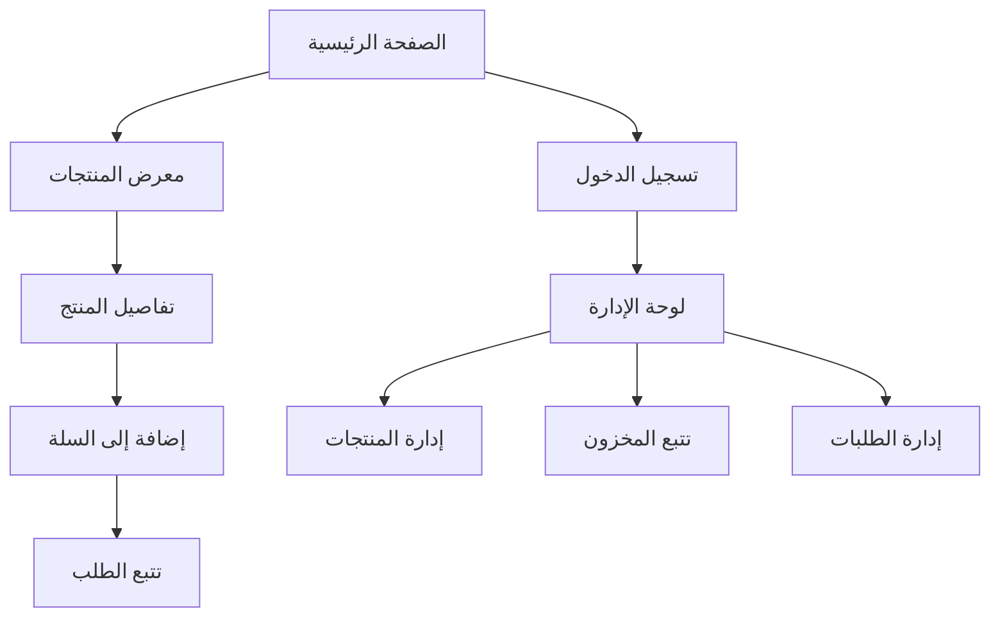

## 1. Product Overview

موقع إلكتروني لمتجر ملابس العلامة التجارية المحلية MK. يعرض المنتجات بشكل احترافي مع تصميم يتماشى مع شعار MK (نص "MK" الأبيض مع رؤى التسلق على خلفية سوداء).

العلامة التجارية: "MK local brsnd" - متجر ملابس محلي يستهدف العملاء الباحثين عن منتجات عالية الجودة بتصميمات فريدة.

## 2. Core Features

### 2.1 User Roles

| الدور                 | طريقة التسجيل              | الصلاحيات الأساسية                          |
| --------------------- | -------------------------- | ------------------------------------------- |
| زائر                  | بدون تسجيل                 | تصفح المنتجات، مشاهدة التفاصيل              |
| عميل                  | التسجيل بالبريد الإلكتروني | تصفح المنتجات، الطلب، تتبع الطلبات          |
| مالك العلامة التجارية | تسجيل خاص من لوحة الإدارة  | إدارة المنتجات، تتبع المخزون، إدارة الطلبات |

### 2.2 Feature Module

يتكون موقع MK من الصفحات الرئيسية التالية:

1. **الصفحة الرئيسية**: معرض المنتجات، شريط التنقل، قسم التصنيفات.
2. **صفحة تفاصيل المنتج**: معلومات المنتج، الصور، الخيارات، زر الإضافة إلى السلة.
3. **صفحة معرض المنتجات**: عرض جميع المنتجات مع فلاتر البحث والتصنيف.
4. **لوحة تحكم الإدارة**: إدارة المنتجات، المخزون، الطلبات.
5. **صفحة تسجيل الدخول**: للوصول إلى لوحة الإدارة.
6. **صفحة تتبع الطلبات**: لمتابعة حالة الطلبات.

### 2.3 Page Details

| اسم الصفحة         | اسم الوحدة     | وصف الميزة                                                  |
| ------------------ | -------------- | ----------------------------------------------------------- |
| الصفحة الرئيسية    | شريط التنقل    | يحتوي على شعار MK، روابط التنقل الرئيسية، زر الدخول للإدارة |
| الصفحة الرئيسية    | معرض المنتجات  | عرض المنتجات المميزة في شبكة من الصور مع الأسماء والأسعار   |
| الصفحة الرئيسية    | قسم التصنيفات  | عرض تصنيفات المنتجات الرئيسية (قمصان، بناطيل، اكسسوارات)    |
| صفحة تفاصيل المنتج | معرض الصور     | عرض صور المنتج مع إمكانية التكبير والتصفح بين الصور         |
| صفحة تفاصيل المنتج | معلومات المنتج | عرض الاسم، الوصف، السعر، الخيارات المتاحة (المقاس، اللون)   |
| صفحة تفاصيل المنتج | زر الإضافة     | إضافة المنتج إلى السلة مع اختيار الكمية                     |
| صفحة معرض المنتجات | فلاتر البحث    | تصفية المنتجات حسب التصنيف، السعر، المقاس                   |
| صفحة معرض المنتجات | شبكة المنتجات  | عرض المنتجات في شبكة متجاوبة مع معلومات أساسية              |
| لوحة تحكم الإدارة  | إدارة المنتجات | إضافة، تعديل، حذف المنتجات مع رفع الصور                     |
| لوحة تحكم الإدارة  | تتبع المخزون   | عرض حالة المخزون، التنبيهات بنقص الكمية                     |
| لوحة تحكم الإدارة  | إدارة الطلبات  | عرض الطلبات، تغيير الحالة، طباعة الفواتير                   |
| صفحة تسجيل الدخول  | نموذج الدخول   | إدخال اسم المستخدم وكلمة المرور للوصول للإدارة              |
| صفحة تتبع الطلبات  | حالة الطلب     | عرض تفاصيل الطلب مع تحديثات الحالة                          |

## 3. Core Process

### تدفق العميل:

1. يدخل الموقع ويتصفح المنتجات في الصفحة الرئيسية
2. يختار منتج معين لرؤية التفاصيل
3. يمكنه تصفية المنتجات حسب التصنيفات
4. يضيف المنتجات التي يريدها
5. يتابع حالة طلبه لاحقاً

### تدفق مالك العلامة التجارية:

1. يدخل إلى لوحة الإدارة باستخدام بياناته
2. يضيف منتجات جديدة مع الصور والتفاصيل
3. يتابع حالة المخزون ويحدث الكميات
4. يدير الطلبات الواردة ويغير حالاتها
5. يولد تقارير عن المبيعات والمخزون

## 4. User Interface Design

### 4.1 Design Style

* **الألوان الأساسية**: الأسود والأبيض مع لمسات من الرمادي الفاتح

* **شعار العلامة التجارية**: نص "MK" أبيض على خلفية سوداء مع رؤى التسلق

* **أسلوب الأزرار**: تصميم مسطح مع حواف دائررة قليلاً

* **الخطوط**: خطوط حديثة وواضحة (Arial أو Helvetica)

* **أسلوب التخطيط**: تصميم شبكي حديث مع مسافات بيضاء وافية

* **الأيقونات**: أيقونات بسيطة وحديثة تتناسب مع الطابع الاحترافي

### 4.2 Page Design Overview

| اسم الصفحة         | اسم الوحدة       | عناصر واجهة المستخدم                                          |
| ------------------ | ---------------- | ------------------------------------------------------------- |
| الصفحة الرئيسية    | شريط التنقل      | شعار MK في اليسار، قائمة التنقل في الوسط، زر الدخول في اليمين |
| الصفحة الرئيسية    | معرض المنتجات    | شبكة من 3-4 أعمدة تعرض صور المنتجات مع الأسماء والأسعار       |
| الصفحة الرئيسية    | قسم التصنيفات    | بطاقات أفقية تعرض أيقونات التصنيفات مع الأسماء                |
| صفحة تفاصيل المنتج | معرض الصور       | معرض صور رئيسي مع صور مصغرة تحته                              |
| صفحة تفاصيل المنتج | معلومات المنتج   | عنوان المنتج، الوصف التفصيلي، السعر بخط عريض                  |
| صفحة تفاصيل المنتج | خيارات المنتج    | مربعات اختيار للمقاس واللون مع معاينة مباشرة                  |
| صفحة معرض المنتجات | فلاتر البحث      | قائمة منسدلة للتصنيفات، شريط تمرير للسعر                      |
| صفحة معرض المنتجات | شبكة المنتجات    | شبكة متجاوبة تتكيف مع حجم الشاشة                              |
| لوحة تحكم الإدارة  | جدول المنتجات    | جدول يعرض جميع المنتجات مع خيارات التعديل والحذف              |
| لوحة تحكم الإدارة  | نموذج إضافة منتج | حقول لإدخال التفاصيل، زر رفع الصور، حفظ/إلغاء                 |

### 4.3 Responsiveness

* **تصميم متجاوب**: يعمل على جميع أحجام الشاشات

* **الجوال أولاً**: يتم تحسين التجربة للهواتف المحمولة

* **اللمس**: أزرار كبيرة وسهلة النقر للأجهزة اللمسية

* **التحميل السريع**: صور محسنة للويب مع تحميل كسول

