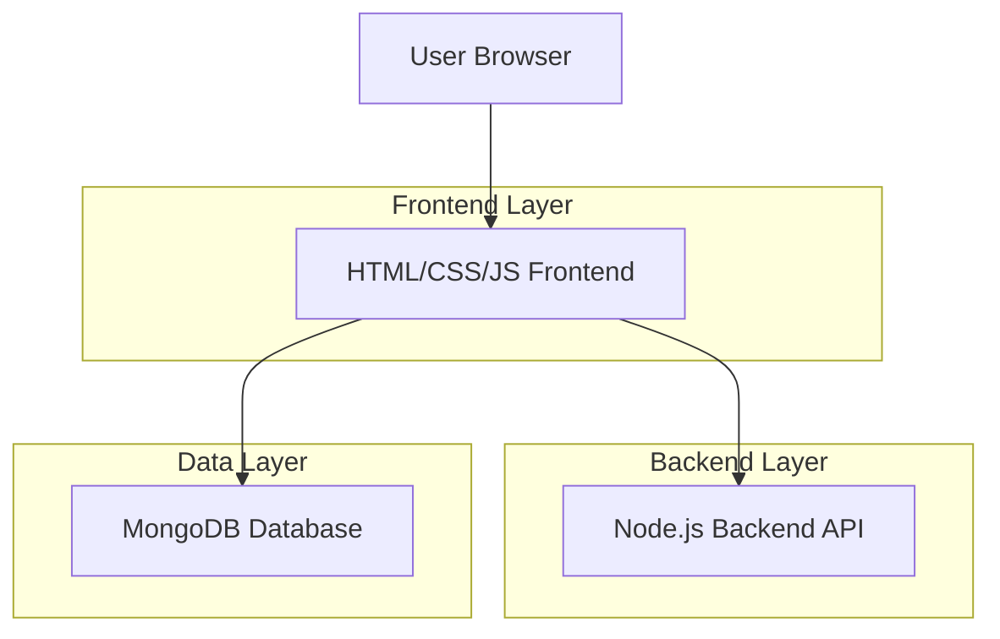
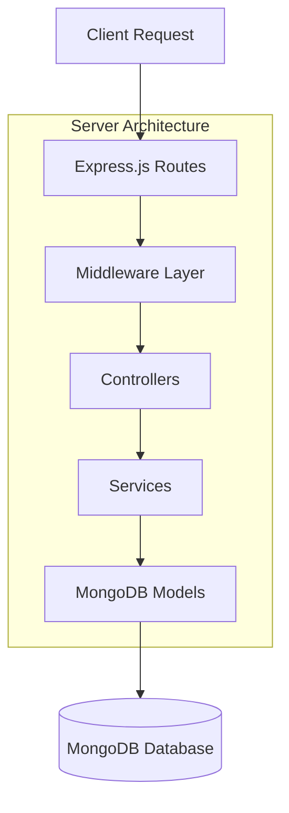
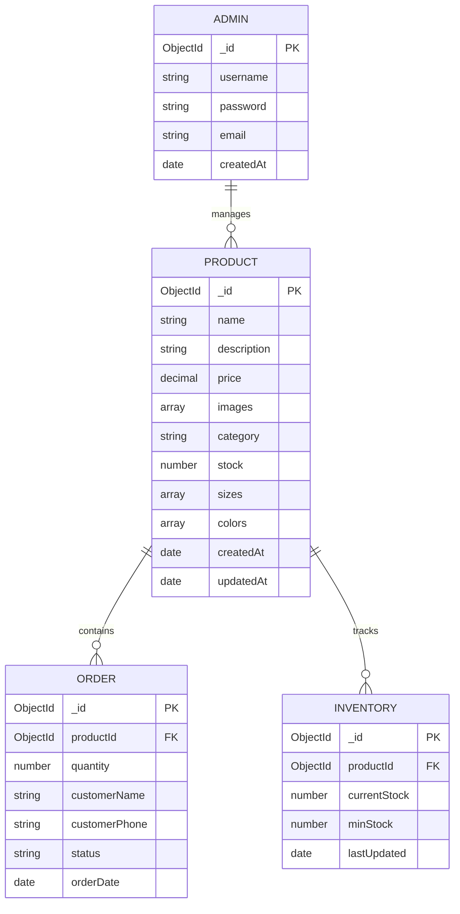

## 1. Architecture design



## 2. Technology Description

* **Frontend**: HTML5 + CSS3 + JavaScript (ES6+)

* **Backend**: Node.js + Express.js

* **Database**: MongoDB (MongoDB Atlas)

* **Styling**: CSS Grid/Flexbox + CSS Custom Properties

* **Image Handling**: Multer for file uploads

* **Environment**: dotenv for environment variables

## 3. Route definitions

| المسار               | الغرض                                   |
| -------------------- | --------------------------------------- |
| /                    | الصفحة الرئيسية، عرض المنتجات المميزة   |
| /products            | معرض جميع المنتجات مع الفلاتر           |
| /product/:id         | صفحة تفاصيل المنتج الفردي               |
| /admin/login         | صفحة تسجيل دخول المسؤول                 |
| /admin/dashboard     | لوحة تحكم الإدارة الرئيسية              |
| /admin/products      | إدارة المنتجات (CRUD operations)        |
| /admin/inventory     | تتبع المخزون والتقارير                  |
| /api/products        | API للحصول على قائمة المنتجات           |
| /api/product/:id     | API للحصول على تفاصيل منتج معين         |
| /api/admin/products  | API لإدارة المنتجات (POST, PUT, DELETE) |
| /api/admin/inventory | API للحصول على بيانات المخزون           |

## 4. API definitions

### 4.1 Core API

#### الحصول على جميع المنتجات

```
GET /api/products
```

Response:

```json
{
  "success": true,
  "data": [
    {
      "_id": "product_id",
      "name": "اسم المنتج",
      "description": "وصف المنتج",
      "price": 99.99,
      "images": ["url1", "url2"],
      "category": "قمصان",
      "stock": 15,
      "sizes": ["S", "M", "L", "XL"],
      "colors": ["أسود", "أبيض"]
    }
  ]
}
```

#### إضافة منتج جديد (Admin only)

```
POST /api/admin/products
```

Request:

```json
{
  "name": "اسم المنتج الجديد",
  "description": "وصف تفصيلي للمنتج",
  "price": 129.99,
  "category": "بناطيل",
  "stock": 20,
  "sizes": ["S", "M", "L"],
  "colors": ["أسود", "رمادي"]
}
```

#### تسجيل دخول المسؤول

```
POST /api/admin/login
```

Request:

```json
{
  "username": "admin",
  "password": "password123"
}
```

Response:

```json
{
  "success": true,
  "token": "jwt_token_here",
  "message": "تم تسجيل الدخول بنجاح"
}
```

## 5. Server architecture diagram



## 6. Data model

### 6.1 Data model definition



### 6.2 Data Definition Language

#### جدول المنتجات (Products)

```javascript
// MongoDB Schema
const productSchema = {
  name: {
    type: String,
    required: true,
    trim: true
  },
  description: {
    type: String,
    required: true
  },
  price: {
    type: Number,
    required: true,
    min: 0
  },
  images: [{
    type: String,
    required: true
  }],
  category: {
    type: String,
    required: true,
    enum: ['قمصان', 'بناطيل', 'اكسسوارات', 'جاكيتات', 'احذية']
  },
  stock: {
    type: Number,
    required: true,
    min: 0,
    default: 0
  },
  sizes: [{
    type: String,
    enum: ['XS', 'S', 'M', 'L', 'XL', 'XXL']
  }],
  colors: [{
    type: String,
    required: true
  }],
  featured: {
    type: Boolean,
    default: false
  },
  createdAt: {
    type: Date,
    default: Date.now
  },
  updatedAt: {
    type: Date,
    default: Date.now
  }
};
```

#### جدول المسؤولين (Admins)

```javascript
const adminSchema = {
  username: {
    type: String,
    required: true,
    unique: true,
    trim: true
  },
  password: {
    type: String,
    required: true
  },
  email: {
    type: String,
    required: true,
    unique: true,
    lowercase: true
  },
  role: {
    type: String,
    enum: ['super_admin', 'admin'],
    default: 'admin'
  },
  createdAt: {
    type: Date,
    default: Date.now
  }
};
```

#### جدول الطلبات (Orders)

```javascript
const orderSchema = {
  productId: {
    type: ObjectId,
    ref: 'Product',
    required: true
  },
  quantity: {
    type: Number,
    required: true,
    min: 1
  },
  customerName: {
    type: String,
    required: true
  },
  customerPhone: {
    type: String,
    required: true
  },
  customerEmail: {
    type: String
  },
  status: {
    type: String,
    enum: ['pending', 'confirmed', 'processing', 'shipped', 'delivered', 'cancelled'],
    default: 'pending'
  },
  totalAmount: {
    type: Number,
    required: true
  },
  orderDate: {
    type: Date,
    default: Date.now
  }
};
```

### بيانات التهيئة الأولية

```javascript
// إضافة مسؤول افتراضي
db.admins.insertOne({
  username: "admin",
  password: "$2b$10$hashed_password_here",
  email: "admin@mk-local.com",
  role: "super_admin",
  createdAt: new Date()
});

// إضافة منتجات نموذجية
db.products.insertMany([
  {
    name: "قميص MK كلاسيكي",
    description: "قميص قطني عالي الجودة بتصميم كلاسيكي",
    price: 89.99,
    images: ["/images/classic-shirt-1.jpg", "/images/classic-shirt-2.jpg"],
    category: "قمصان",
    stock: 25,
    sizes: ["S", "M", "L", "XL"],
    colors: ["أبيض", "أسود", "رمادي"],
    featured: true,
    createdAt: new Date(),
    updatedAt: new Date()
  },
  {
    name: "بنطال MK رياضي",
    description: "بنطال رياضي مريح بتصميم عصري",
    price: 129.99,
    images: ["/images/sports-pants-1.jpg"],
    category: "بناطيل",
    stock: 15,
    sizes: ["M", "L", "XL"],
    colors: ["أسود", "كحلي"],
    featured: false,
    createdAt: new Date(),
    updatedAt: new Date()
  }
]);
```

### إنشاء الفهارس

```javascript
// إنشاء فهارس لتحسين الأداء
db.products.createIndex({ category: 1 });
db.products.createIndex({ price: 1 });
db.products.createIndex({ featured: 1 });
db.orders.createIndex({ status: 1 });
db.orders.createIndex({ orderDate: -1 });
```

